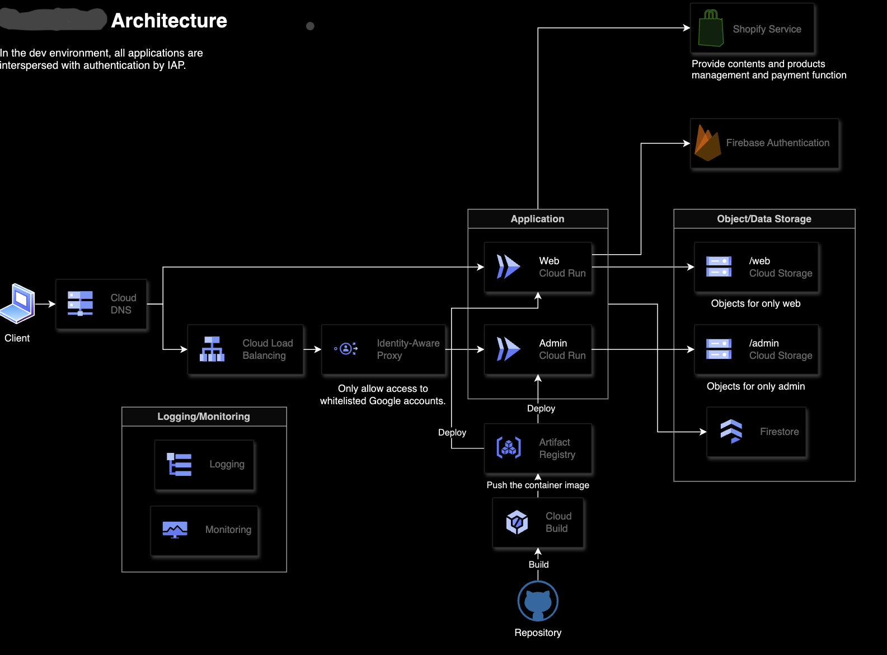

# 🌍 Monorepo なアプリケーションをサーバーレスで動かすときのアーキテクチャ紹介

<style scoped>
section { 
    font-size: 28px; 
}
</style>

2023.07.12
tatti ([@tachibanayu24](https://twitter.com/tachibanayu24))

---

# はなすこと

- 最近 serverless で monorepo なアプリケーションを開発していてそのアーキテクチャを紹介する
  - 構成を考えたけど結局実現しなかったので供養したい意図
- 主にインフラだけど実装も少し

---

# 要件

- EC サイト
  - 管理画面とショップ
  - shopify 利用
- 管理画面や staging は認証が必要
- 専任エンジニアがいないのでインフラ管理のコストを抑えたい
- とはいえ監視はしたい

---

# 構成図



---

# ポイント紹介

## Cloud IAP(Identity-Aware Proxy)

今回は管理者として認証が必要な場合は Load Balancing して IAP を経由する構成で省エネ。

- IAP(アイデンティティ認識型プロキシ)とは、利用者とアプリケーションの認証基盤や認可情報などを仲介するプロキシ
- Cloud IAP はフルマネージドリバースプロキシとして利用できる
  - もちろん Bastion(踏み台)サーバー的な役割も担える
  - Google アカウントの認証を利用できる
  - ブラウザに認証情報がない場合は Google のログインフローにリダイレクトされる

---

# ポイント紹介

## Cloud Logging

十分な機能を備えたログ管理。

- Error Reporting
  - 例外を分析して意味単位のグループに集約できる
- アラート機能もあり使いやすい
- Audit Log
  - アプリケーションに閉じずプロジェクトの管理アクティビティを関し
  - やっておくに越したことはない

---

# ポイント紹介

## Cloud Monitoring

インフラ監視。

- パフォーマンス監視
  - やばいときはアラートを挙げられる
- 可用性、健全性
  - 目標 SLA を設定して監視可能
- ログ通知
  - 任意の条件のログを検知したら slack に通知できる

---

# ポイント紹介

## Firebase Authentication

今回 Shopify に商品データなど薄く保存して、それ以外は Firestore や Firebase でデータを管理する予定だった。

- カスタムクレーム
  - アカウントの属性をカスタムし定義できる
  - サブスク有効中？
  - shopify のユーザー ID は？
  - 一般ユーザー？内部のテストユーザー？

---

# Remix の実装紹介

## Remix Server Context のカスタマイズ

```ts
const handleRequest = createRequestHandler({
  build: remixBuild,
  mode: process.env.NODE_ENV,
  getLoadContext: (): AppLoadContext => ({
    session, // sessionインスタンス
    storefront, // shopify sdkクライアント
    customerAccount, // shopify API
    cart, // カートの中身
    env, // 環境変数
  }),
});
```

---

## Remix Server Context のカスタマイズ

```ts
export async function loader({ context }: LoaderFunctionArgs) {
  const { storefront } = context;

  const allProducts = storefront.query(ALL_PRODUCTS_QUERY);

  ...

  return defer({ ... });
}
```
